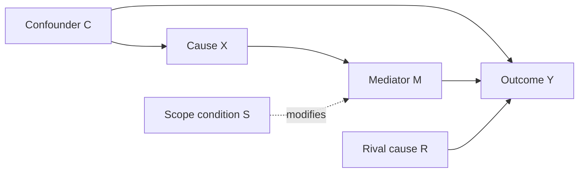

# Causal Relations And Variables

Use this reference to clarify what counts as a causal relation and how to map the variables in an IR research design.

## Causal Relation

A causal claim in research must answer more than “what is related to what?” It should answer:

- What is the cause?
- What is the outcome?
- Does the cause precede the outcome?
- Is there association or systematic co-variation?
- Would the outcome differ if the cause were absent or different?
- Through what process does the cause generate the outcome?
- What rival causes might produce the same outcome?

## Three Causal Lenses

### Regularity

Regularity thinking treats causation as patterned association between cause and outcome. In deterministic form, X necessarily leads to Y. In probabilistic form, X increases or decreases the probability of Y.

Use regularity thinking when:

- The research has many observations.
- The goal is to identify whether X is associated with Y.
- The claim is about average effects or probabilistic tendencies.

Risk: association alone is not causation. Common threats include omitted variables, reverse causality, selection bias, and measurement error.

### Counterfactual Dependence

Counterfactual thinking asks whether Y would have changed if X had not occurred or had taken a different value. It underlies causal-effect reasoning.

Use counterfactual thinking when:

- Explaining a particular event or case.
- Estimating the causal effect of a treatment/intervention/exposure.
- Comparing actual outcomes with plausible alternative worlds.

Risk: the counterfactual outcome is not directly observable. It must be approximated through comparable cases, within-case evidence, historical plausibility, or explicit assumptions.

### Mechanism

Mechanism thinking asks how X produces Y. A mechanism is a connected process involving actors, entities, choices, resources, beliefs, institutions, and interactions.

Use mechanism thinking when:

- The research is a case study or small-N comparison.
- The causal claim depends on a process, not just co-variation.
- The user needs to explain why a cause works in one context but not another.

Risk: listing events is not the same as identifying a mechanism. Each step must be linked to the previous and next step.

## Effects-Of-Causes vs Causes-Of-Effects

Effects-of-causes asks: “What effect does X have on Y, and how large is that effect?” This fits experiments, quasi-experiments, statistics, and some comparative designs.

Causes-of-effects asks: “Why did this Y occur?” This fits historical explanation, process tracing, causal narratives, and case studies.

Many IR projects mix both:

- Use statistical or comparative patterns to identify likely X-Y relations.
- Use case evidence and process tracing to explain how the relation works.

## Variable Roles

### Independent Variable X

The proposed cause. It must vary across cases, time, units, or conditions. A concept becomes a variable only when it can take different values in the research context.

Example: Geography may be constant in a short-period study but variable in a long historical study.

### Dependent Variable Y

The outcome to be explained. Define the outcome before choosing causes.

Specify:

- Unit: state, dyad, organization, crisis, treaty, conflict episode, leader, firm, public.
- Time period.
- Spatial or institutional scope.
- Variation: occurrence/non-occurrence, degree, timing, form, success/failure.

### Mediator M

A mediator transmits the effect of X to Y. It answers “through what pathway?”

Formula:

```text
X -> M -> Y
```

Do not control away a mediator when estimating the total effect of X. If the goal is to test the mechanism, examine M directly.

### Moderator / Scope Condition S

A moderator changes the strength, direction, or existence of the X-Y relation. It answers “under what conditions?”

Formula:

```text
X -> Y is stronger/weaker/only present when S holds.
```

Common IR scope conditions:

- Regime type.
- Alliance dependence.
- Power asymmetry.
- Threat environment.
- Institutional density.
- Issue salience.
- Domestic veto players.
- International norm maturity.
- Information uncertainty.

### Confounder C

A confounder affects both X and Y, making the X-Y relation spurious or biased.

Formula:

```text
C -> X
C -> Y
X -> Y ? 
```

Confounders must be controlled, matched, compared, or explicitly addressed.

### Collider D

A collider is a common effect of X and Y, or of X and another cause of Y. Conditioning on a collider can create false association.

Formula:

```text
X -> D <- Y
```

Warning: do not select only cases where D appears unless selection is theoretically justified.

### Control Variable

A control variable is used to isolate the relationship of interest. Controls should be theoretically justified. Do not add controls mechanically; bad controls can hide mechanisms, introduce bias, or make the explanation incoherent.

## Causal Diagram Rules

Use directed arrows to represent hypothesized causal direction:



Rules:

- Arrow means assumed causal direction, not direct observation.
- No arrow means the design assumes no direct causal relation.
- Time order should be consistent with arrows.
- Place mediators between X and Y.
- Place confounders before X and Y.
- Avoid controlling for colliders or post-treatment variables unless the research goal requires it and the implication is stated.

## Diagnostic Questions

- Is the outcome clearly defined before the cause?
- Does X vary in the chosen research context?
- Could Y affect X instead?
- What common cause might affect both X and Y?
- What mechanism links X to Y?
- What condition changes the effect of X?
- Which variable should be observed, controlled, compared, or left uncontrolled?

