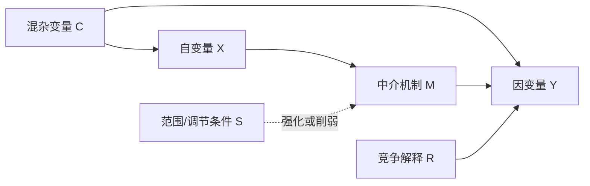

# Templates And Checklists

Use this reference for direct outputs, critique, and proposal scaffolding.

## One-Page Causal Design

| Element | Content |
|---|---|
| Topic | |
| Research puzzle | |
| Research question | |
| Outcome Y | |
| Unit / scope | |
| Main cause X | |
| Mechanism M | |
| Scope condition S | |
| Rival explanations R | |
| Main hypothesis H1 | |
| Mechanism hypotheses | |
| Observable implications | |
| Method | |
| Evidence sources | |
| Main inference risk | |

## Causal Mechanism Scaffold

```text
1. Background condition:
2. Cause X appears or changes:
3. Actor A notices/interprets X:
4. X changes A's beliefs/incentives/capabilities/information:
5. A changes behavior:
6. Other actors or institutions respond:
7. Intermediate condition emerges:
8. Outcome Y occurs:
9. Observable traces:
10. Rival mechanism traces:
```

## Hypothesis Set Template

```text
H1 主假设:
在[范围/条件S]下，[X增加/出现/改变]会使[Y更可能/更强/更弱/更早/更晚]，因为[M机制]。

H1a 机制假设:
如果[M机制]成立，应观察到[O1]、[O2]、[O3]按时间顺序出现。

H2 条件假设:
当[S条件]存在时，X对Y的影响更强；当[S条件]不存在时，该影响减弱或消失。

HR 竞争假设:
Y并非由X解释，而是由[R]解释；如果HR成立，应观察到[OR]而不是[OM]。
```

## Rival Explanation Matrix

| Rival explanation | Why plausible | Evidence if true | Evidence against it | Relation to main X |
|---|---|---|---|---|
| Structural | | | | confounder / rival / scope |
| Domestic | | | | |
| Economic | | | | |
| Ideational | | | | |
| Institutional | | | | |
| Leadership | | | | |

## Process-Tracing Table

| Step | Mechanism claim | Expected evidence | Actual evidence | Test strength | Rival interpretation |
|---|---|---|---|---|---|
| 1 | X appears | | | | |
| 2 | Perception/incentive changes | | | | |
| 3 | Behavior changes | | | | |
| 4 | Interaction/institution changes | | | | |
| 5 | Y occurs | | | | |

Test strength options: straw-in-the-wind, hoop, smoking-gun, doubly decisive.

## Counterfactual Template

| Question | Answer |
|---|---|
| Actual outcome | |
| Cause/treatment X | |
| Counterfactual change | |
| Held-constant conditions | |
| Why this counterfactual is plausible | |
| Expected alternative mechanism | |
| Expected alternative outcome | |
| Evidence supporting plausibility | |
| Main uncertainty | |

## Causal Diagram Template



## Critique Checklist

- Outcome Y is explicit and not just a topic.
- Unit, period, and case scope are stated.
- X precedes Y.
- X varies in the research context.
- Correlation or relevant association is plausible.
- Mechanism is stepwise rather than a label.
- Each mechanism step has observable traces.
- Scope condition is stated.
- Rival explanations are named.
- Confounders are considered.
- Mediators are not accidentally controlled away.
- Colliders or selection filters are not introduced silently.
- Hypotheses are directional and testable.
- Evidence can distinguish the main explanation from rivals.
- The conclusion does not claim more than the design can support.

## Proposal Outline For Causal IR Research

1. Introduction
   - Puzzle, question, argument, contribution, method.
2. Literature Review
   - Organize by explanations, mechanisms, or debates.
3. Theory And Causal Explanation
   - Define X, Y, mechanism, scope, rivals.
4. Hypotheses
   - Main, mechanism, scope, and rival hypotheses.
5. Research Design
   - Case selection, evidence, method, inference risks.
6. Empirical Analysis
   - Test hypotheses; do not merely narrate history.
7. Conclusion
   - Answer the question, state limits, identify implications.

