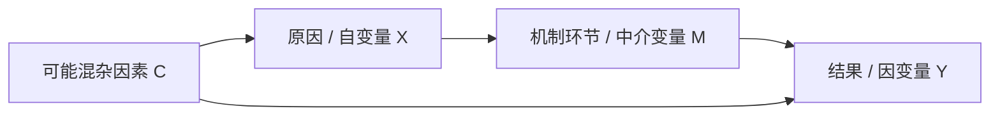

# Templates

Use these templates only after understanding the user's specific topic. They are checklists and output aids, not mechanism generators.

## Anti-Template Use

Before using any template, write a short topic-specific diagnosis:

```text
This topic is special because...
The key actors/entities are...
The relevant context is...
The mechanism should therefore focus on...
```

Do not fill the same mechanism chain for different topics. If two topics produce the same mechanism, re-check whether the actors, context, issue area, and causal process have been flattened too much.

## Causal Explanation Card

| Element | Draft |
|---|---|
| Topic-specific feature | |
| Research question | |
| Outcome to explain | |
| Proposed cause | |
| Type of causal relation | regularity / counterfactual / mechanism |
| Temporal order | |
| Association or co-variation | |
| False/spurious relation risk | |
| Counterfactual statement | |
| Topic-specific causal mechanism | |
| Applicable range / limit condition | |
| Causal hypothesis | |
| Observable facts for checking | |

## Variable Table

| Role | Variable | Meaning in this research | How it varies in this topic |
|---|---|---|---|
| Dependent variable | | | |
| Independent variable | | | |
| Mediating variable | | | |
| Confounding variable | | | |
| Collider / selection condition | | | |

## Causal Diagram



Adapt node labels to the user's topic. Do not leave the diagram as abstract X-M-Y when the user has provided concrete content.

## Counterfactual Note

| Question | Answer |
|---|---|
| Actual cause X | |
| Actual outcome Y | |
| Counterfactual change | If X had not occurred / had changed to... |
| Conditions held comparable | |
| Expected counterfactual outcome | |
| Why this counterfactual is plausible for this topic | |
| Main uncertainty | |

## Mechanism Chain

Use this only as a skeleton. Replace each line with the topic's concrete actors, entities, and activities.

```text
1. Topic-specific cause appears or changes:
2. Which actor/entity is affected:
3. What changes in belief/incentive/capability/information/legitimacy/constraint:
4. What activity or behavior changes:
5. What intermediate process follows:
6. How the outcome is produced:
```

## Causal Hypothesis Template

```text
当[具体原因]出现或增强时，[具体结果]更可能发生/增强/减弱，
因为[具体主体/实体]通过[具体机制过程]发生了[具体变化]。
```

## Explanation-Principle Checklist

- Cause is clear.
- Outcome is clear.
- Cause precedes outcome.
- Cause and outcome show association or co-variation.
- False/spurious correlation risk is considered.
- Systematic measurement error is considered.
- Counterfactual statement is plausible, or mechanism is traceable.
- Mechanism is more than a chronology.
- Mechanism is specific to this topic's actors, context, and process.
- Hypothesis is clear, specific, testable, and non-tautological.
- Applicable range or limit condition is stated when needed.
